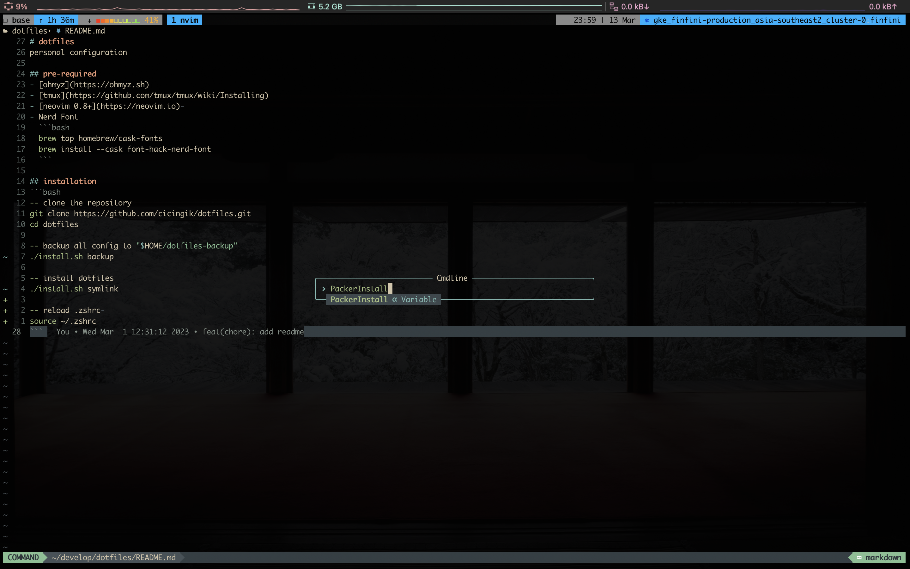

# dotfiles
personal configuration

## pre-required
- [ohmyz](https://ohmyz.sh)
- [tmux](https://github.com/tmux/tmux/wiki/Installing)
- [neovim 0.8+](https://neovim.io) 
- Nerd Font
  ```bash
  brew tap homebrew/cask-fonts
  brew install --cask font-hack-nerd-font
  ```

## installation

### clone repository
```bash
git clone https://github.com/cicingik/dotfiles.git
cd dotfiles

-- backup all config to "$HOME/dotfiles-backup"
./install.sh backup

-- install dotfiles
./install.sh symlink

-- reload .zshrc 
source ~/.zshrc
```

### installing tmux plugins
just open `tmux` for auto install all needed plugins
```bash
tmux
```

### installing plugin neovim
```bash
-- open some file
v README.md
```
run `PackerInstall`

<div align="center">
  
</div>
